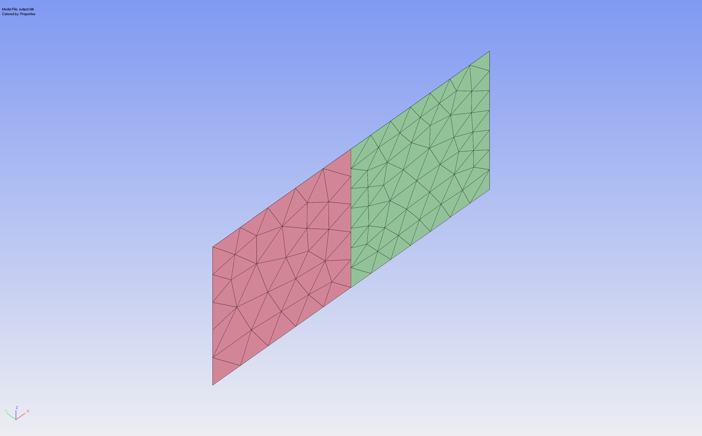
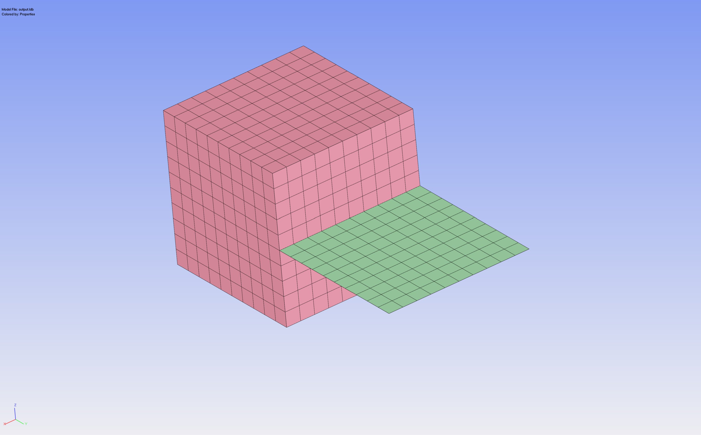

# med2limit

Convert Code_Aster MED/RMED simulation results into LIMIT `.linp` / `.lui` input files for fatigue analysis.

## Features

- Shell workflows (DKT elements: S3, S4, STRI65, S8R) with REPLO/CARCOQUE handling
- Linear solid workflows (C3D8 / HEXA8, C3D6 / PENTA6) with validated LIMIT node ordering
- Multi-step / multi-increment displacement and stress transfer
- Optional shell orientation file, or read directly from `IMPR_CONCEPT`-embedded result file
- Automatic detection of shell support level (works for shell-only and mixed hexa+shell models)
- Salome-safe execution (no `sys.exit`)

## Installation

MEDCoupling with pip into a virtual python environnement (venv):

```bash
python3 -m venv .venv
source .venv/bin/activate
pip install git+https://github.com/simvia-tech/med2limit.git@dev
```

## Usage

### Command line
From 01_exemple in folder:
```bash
med2limit/exemples/data
```

```bash
med2limit 01_exemple.rmed output.linp output.lui --groups "Shell1,Shell2" --nsets "WeldNo"
```

With separate orientation file:

```bash
med2limit 01_exemple.rmed output.linp output.lui 01_carcoc.rmed --groups "Shell1,Shell2" --nsets "WeldNo"
```
# 01_exemple

Code_aster Shell-Shell geometry successfully imported in LIMIT Software

# 02_exemple

Code_aster Solid-Shell geometry successfully imported in LIMIT Software

### Python API

```python
from med2limit import MEDToLimitConverter

conv = MEDToLimitConverter(
    med_filename="LIMIT1.rmed",
    linp_filename="out.linp",
    lui_filename="out.lui",
    active_groups=["Shell1", "Shell2"],
    active_nsets=["Weld"],
)
conv.convert()
```

## Package layout

```
med2limit/
├── element_types.py   # MED↔LIMIT type mapping + helpers (pure)
├── reader.py          # MED file open + field lookup
├── mesh.py            # nodes, elements, GROUP_MA, GROUP_NO
├── fields.py          # DEPL + SIEF over all timesteps
├── orientation.py     # REPLO + CARCOQUE (embedded or separate)
├── filter.py          # active group selection + shell metadata mapping
├── result_mapper.py   # per-timestep stress/displacement mapping
├── writer.py          # .linp + .lui output
├── converter.py       # orchestrator (step_1 .. step_6 + convert)
└── cli.py             # CLI + in-script config
```

## Examples

The `examples/` folder contains ready-to-run scripts for typical workflows:

```bash
python examples/01_shell_basic.py
```

Edit the paths at the top of each script before running.

### Salome (embedded Python)

Salome ships with its own Python interpreter, so a `pip install` in a conda env
is not visible inside Salome. Use the provided launcher instead.

1. Keep the package folder and the launcher together:
   ```
   my_workspace/
   ├── med2limit/                      ← the package folder
   └── run_med2limit_in_salome.py      ← edit and run this from Salome
   ```

2. Edit the CONFIGURATION block at the top of `run_med2limit_in_salome.py`
   (paths, groups, nsets).

3. In Salome: **File → Load Script** → choose `run_med2limit_in_salome.py`.

The launcher inserts its own directory into `sys.path` so the embedded Python
can `import med2limit` from source. MEDCoupling is already available inside
Salome — no extra install needed. The launcher never calls `sys.exit()` so it
will not terminate the Salome session.

## Testing

```bash
pytest                      # all tests
pytest tests/test_element_types.py   # one module
```

## Known limitations

- Quadratic solids (C3D10, C3D15, C3D20) — node ordering not yet validated in LIMIT
- Shell elsets with mixed thicknesses use the most-frequent value (with warning)

## Acknowledgments

Special thanks to Tobias and Nikolaus for their feedback as early adopters
and their patience during the iterative development of the converter.
